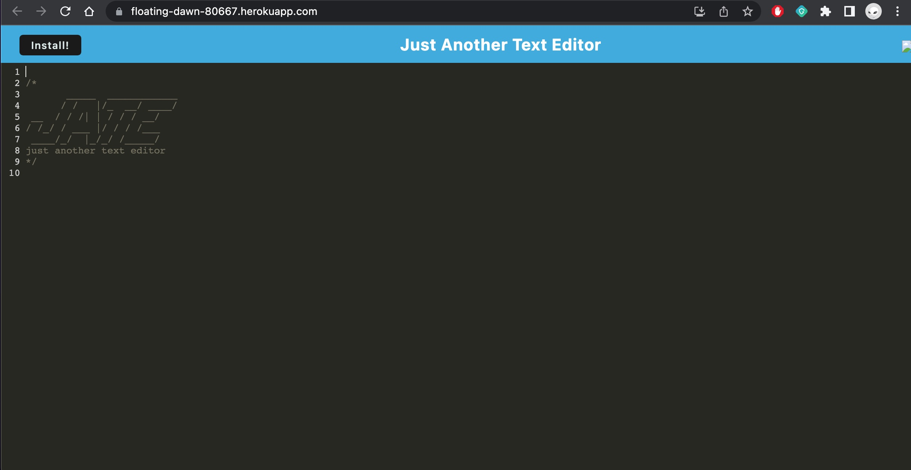

 [] 
# <h1 align="center">JATE: Just Another Text Editor</h1>

## Description
JATE is a Text Editor PWA designed for online & offline functionality using webpack & indexedDB.
 
 
Visit the Deployed application here: https://floating-dawn-80667.herokuapp.com/
 
 

## Table of Contents
  - [Description](#description)
  - [Installation](#installation)
  - [Usage](#usage)
  - [License](#license)
  - [Contributors](#contributors)
  - [Tests](#tests)
  - [Questions](#questions)

## Installation
Clone this repository.  
From the root of the application run `npm install`. 
Then, from the root, run `npm start`.  
To see the build, open LiveServer or visit `localhost:3000`.
  

## Usage
use JATE online or offline to save code snippets anywhere you go!

## License
[]This application is covered under the MIT license. (https://opensource.org/licenses/MIT)

## Contributors
idb, webpack, express, babel, workbox

## Tests
N/A

## Questions? Contact me:
GitHub: https://github.com/ejackson1228/  
Email: ejackson1228@gmail.com
